## Get Started with Redis Enterprise in Google Cloud

## Prerequisites

1. Enable the APIs in your project: `gcp.redisenterprise.com`
2. Ensure your account has the following priviledges (as required):

| Step |  Role or Permisions Required |
| --- | --- |
Purchasing our service | `billing.admin` or `billing.owner` 
Enabling a service | `project.editor` role or `serviceusage.services.enable` 
View Existing Service | `serviceusage.serviceUsageViewer` and `redisenterprisecloud.viewer`
Administer Existing Service | `serviceusage.serviceUsageViewer` and `redisenterprisecloud.admin`

## Follow these steps
1. Log in to your Google Cloud Console https://console.cloud.google.com/
2. Open the Sandwich menu on the left-hand-side and select Redis Enterprise from the Partner Solutions menu segment:
    
    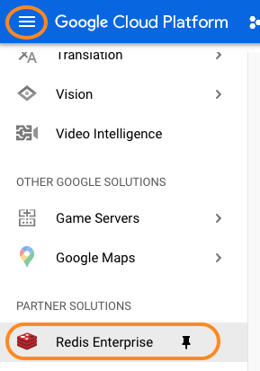

3. You will be prompted to leave the console for the Redis Enterprise Service Manager tool. Please use your Google account credentials to log in to redislabs.com.
      
    
   
4. Chose a name for your subscription, which region you would like it in, whether you want it to be highly-available in Multiple Availability Zones (Multi-AZ), chose a CIDR such as 10.100.0.0/16. 
    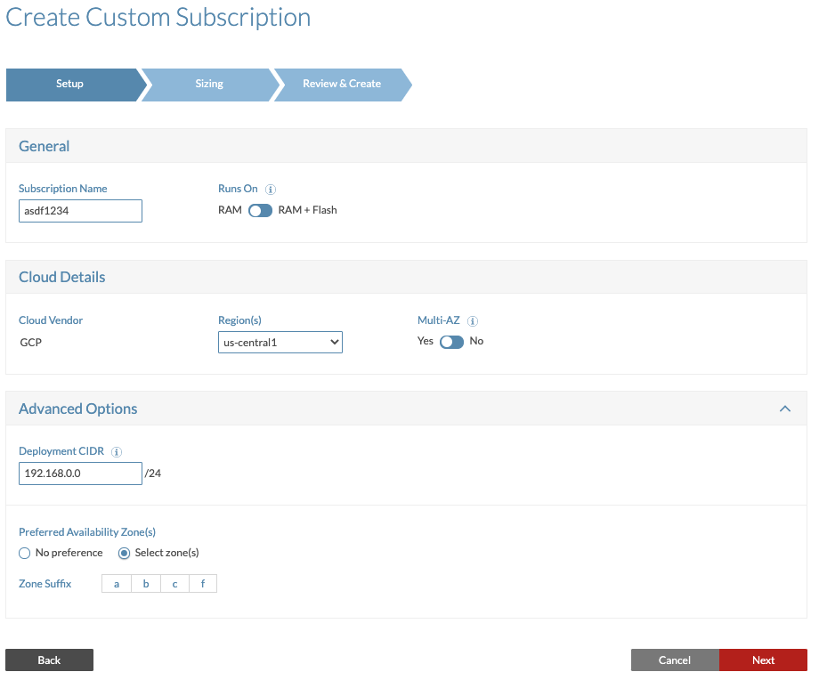
5. Configure your first Redis database for this subscription. 
   * Select an appropriate `memory limit`. This option can be changed on the fly.
   * Leave `replication` enabled for high availability and auto failover support. This option can be changed on the fly.
   * Select `snapshot every hour` to have the DB persist to disk once an hour. This option can be changed on the fly.
   * Leave the Ops/sec as 25k ops/sec (1M+ are supported). This option can be changed on the fly later.
   * (Optional) Chose the `Redisearch-enterprise` module to enable the <a href="http://redisearch.io" target="_blank">Redisearch</a> module to allow for Redis with Query.
   * Leave the option for `OSS Cluster API support` disabled. Note: The architecture of Redis Enterprise incorporates a multi-threaded and dynamically scalable proxy so the `OSS Cluster API` is typically not required for high throughput and high data quantity scenarios.
   * Finally, click save and move on to creating your next Redis DB.
    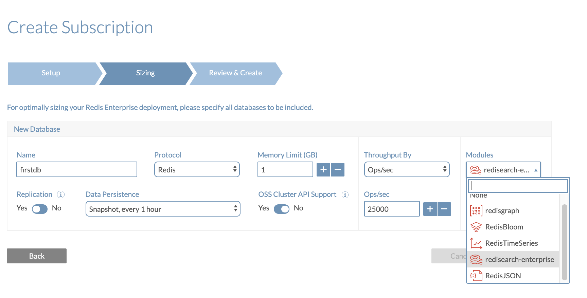
6. Configure your second Redis database for this subscription. *Note*: a Redis Enterprise subscription is both dedicated to you and multi-tenant in the same cluster of infrastructure therefore can contain 100s of individual Redis databases you/your team's different use-cases. Feel free to review the [Redis Enterprise Architecture here](https://redislabs.com/blog/multi-tenancy-redis-enterprise/). 
   * Use the same options as in your first Redis DB but select the `RedisJSON` module instead of `redisearch-enterprise`. <a href="http://redisjson.io" target="_blank">RedisJSON</a> enables Redis-server side JSON document modifications via JSONPATH and #todo to save the time of retrieving the full blob, editing it on the client side, and returning the full blob to Redis.
    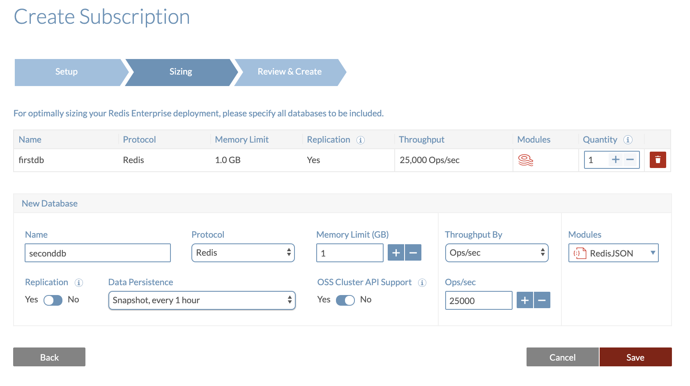
   
   * Click Save for that database.
   * Review your Redis database configurations to be as follows:
    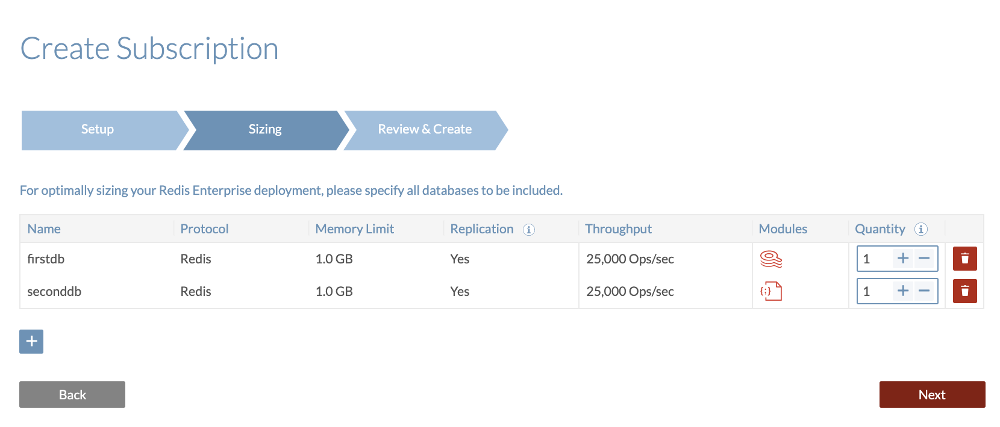 
7. Redis Enterprise will now chose the optimal cloud infrastructure on which to run these two Redis Enterprise Databases while meeting the communicated SLA and performance criteria.
   
    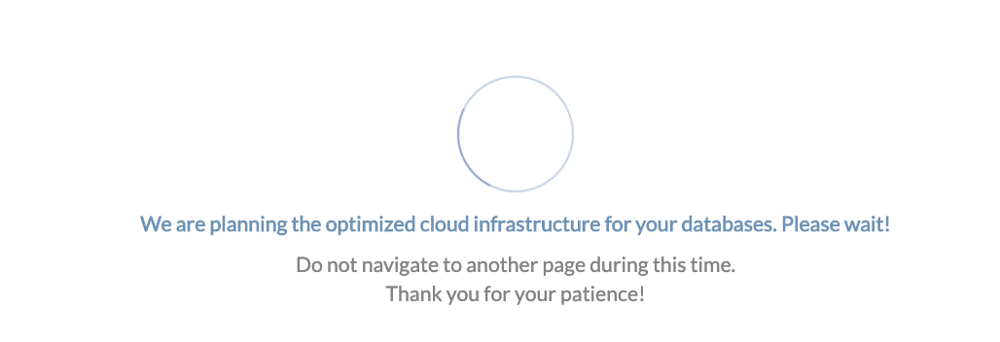  
8.  Review the planned infrastructure resulting from your desired configuration. Please click Continue to continue to deploy your Redis Enterprise Cluster.

    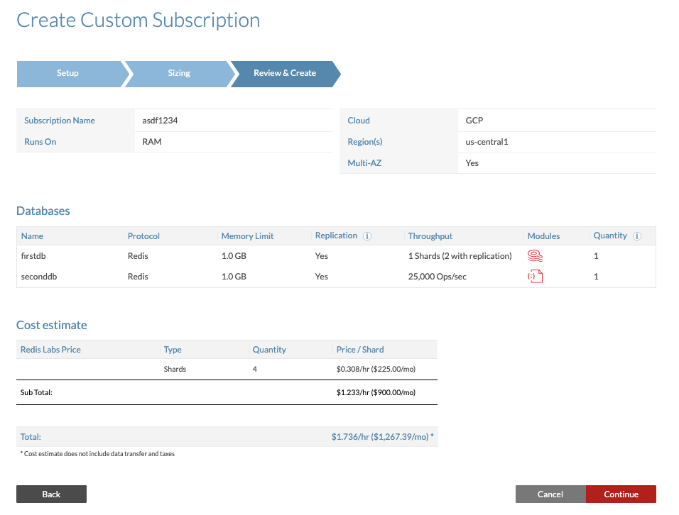 
9.  Redis Labs is deploying your Redis Enterprise Cluster. Please wait a few moments.

    
    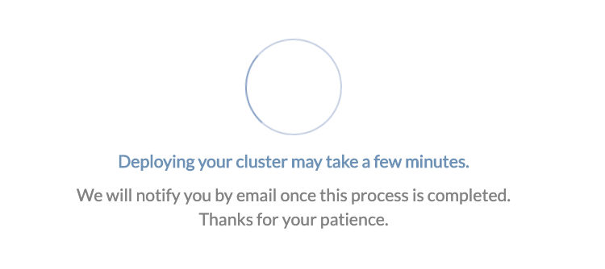   

10. Return to the Subscription screen to view the progress of the Cluster creation. Sandwich menu -> Subscriptions. 
    
    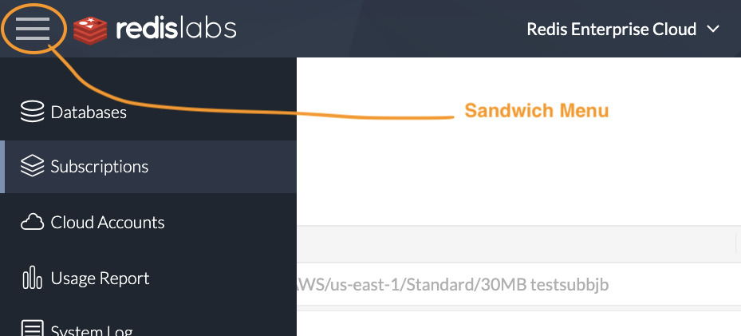
     
    This takes 5 or so minutes to complete. Wait for the Green checkbox to proceed.
    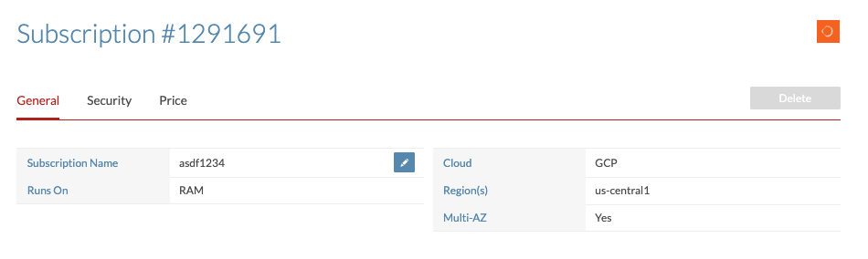  

11. Review both of your databases from the Databases menu. Sandwich menu -> Databases. Note the differences between the two databases: `Shards` count, `clustering`, `persistence`, Modules: `Redisearch`, `RedisJSON`.

    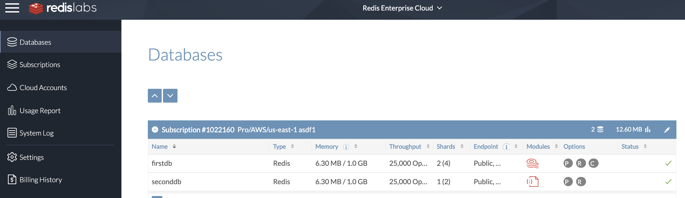 

12. Select the database named firstDB and review it's configuration details. Mark down the database's `public endpoint` and `password`

    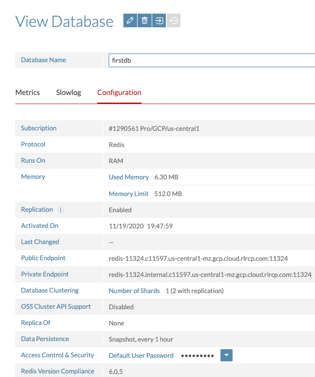

13. Start to use your Redis Enterprise database in Google Cloud! Here are some sample resources to help get you started:
    * <a href="https://google.qwiklabs.com/focuses/14763?parent=catalog&qlcampaign=1m-gtpN1-63#utm_source=linkedin&utm_medium=social&utm_campaign=redis5" target="_blank"> Redisearch 2.0 tutorial on Qwiklabs</a> (1hr): Learn how to use Redis with Query while building a movie database.
    * <a href="https://university.redislabs.com" target="_blank">Redis University</a>: Learn more about Redis in your language of choice in several self-paced courses. Certification is also available!
    * <a href="https://cloud.google.com/solutions/using-memorystore-for-redis-as-a-leaderboard" target="_blank">Build a Gaming Leaderboard with Redis in Kubernetes</a>. From the Google Cloud Solution library. Substitute in your new Redis Enterprise database `Private Endpoint` as the Redis host and port.

## Optional Steps 
Once you've completed this overall workshop, feel free to reconfigure the database's capability with the following:

1. [Enable SSL on your database's connection endpoint](https://docs.redislabs.com/latest/rc/securing-redis-cloud-connections/)
2. [Import data in to your database](https://docs.redislabs.com/latest/rc/how-to/importing-dataset-redis-cloud/) 
3. [Securing your database with VPC Peering and/or CIDR Whitelist](https://docs.redislabs.com/latest/rv/administration/configuration/securing-your-database/)

#### Bonus Content

My colleague has recorded a short video which covers this whole flow described above. <a href="https://www.youtube.com/watch?v=9tP547Lzx6c&feature=youtu.be" target="_blank">Launch on Youtube</a>.

